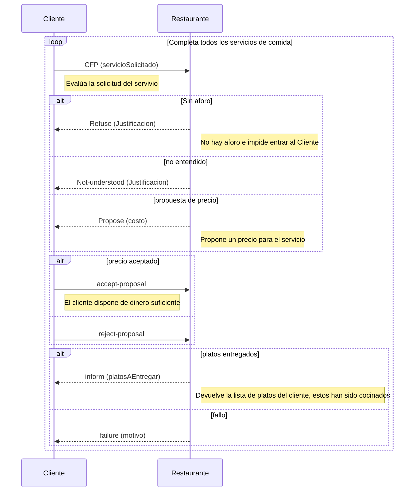
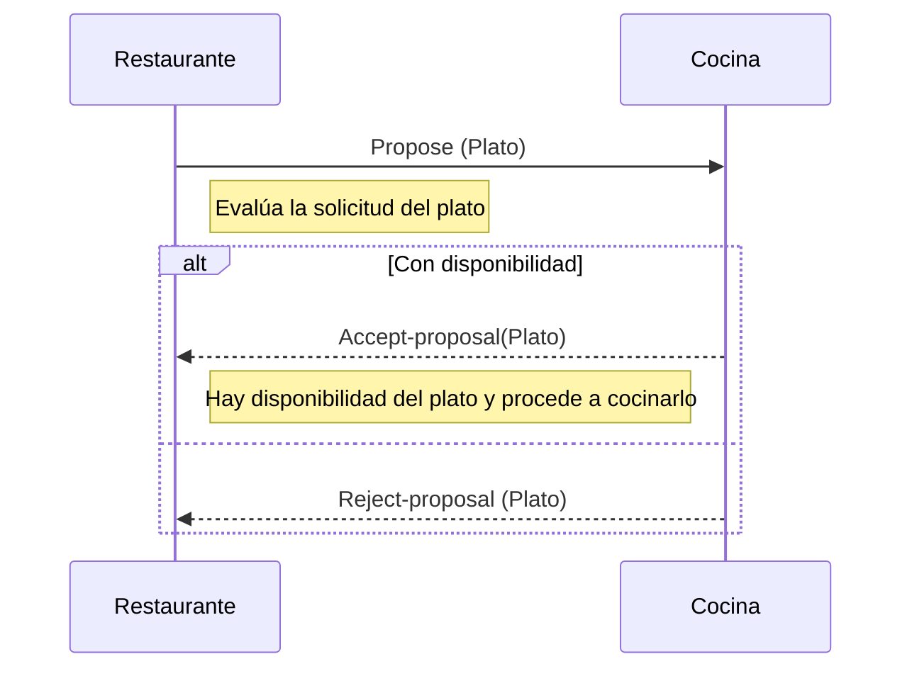


  

# Práctica a realizar (Opcional)

  

En esta práctica será una primera toma de contacto con la creación de agentes y una comunicación básica entre ellos para alcanzar los objetivos que tiene cada agente.

  

  

La práctica consiste en realizar una simulación con agentes sobre el funcionamiento de un restaurante.

  

  

## Definición de Constantes

  

Para la realización de la práctica hay que definir los enumerados con los elementos que se describen:

  

  

-  **OrdenComanda**

  

-  *ENTRANTE*, *PRINCIPAL*, *POSTRE*

  

  

-  **Plato**

  

-  *NOMBRE_DEL_PLATO(OrdenComanda,precio)*

  

- La cantidad de platos estará a cargo de cada uno de vosotros cuando desarrolléis el proyecto.

  

  

## Formato del fichero de configuración

  

Para las pruebas de la práctica se tendrá que aportar un fichero de configuración con el siguiente formato:

  

  

- Estará compuesto por líneas donde estará el nombre del agente, clase y en la línea siguiente los parámetros de configuración para ese agente. Los parámetros estarán en la descripción del agente.

  

-  `nombreAgente:es.ujaen.ssmma.agentes.ClaseAgente`

  

-  `parámetros agente`

  

  

-  **AgenteMonitor** :

  

Será el agente que se crea para la prueba de la práctica y su parámetro es el fichero de configuración.

  

Procesará el fichero de configuración y creará todos los agentes presentes con sus parámetros.

  

  

## Agentes para la práctica

  

Las tareas de los agentes serán diseñadas por cada uno de los alumnos. Los agentes tienen unos parámetros y unos objetivos que deben alcanzar antes de finalizar.

  

  

Todos los agentes:

  

- Deben ser robustos y dar soluciones a las posibles incidencias en la ejecución.

  

- Deberán mostrar de forma clara su ejecución y se guardarán en un archivo el resultado de la ejecución de los agentes.

  

  

-  **AgenteRestaurante**

  

	- Los parámetros del agente será la capacidad de usuarios que puede atender hasta finalizar su servicio. También tendrá definido el número de servicios que podrá dar antes de finalizar.

  

	- Los objetivos del agente son los siguientes:

  

		- Atender la petición de entrada que haga un cliente, si hay disponibilidad de espacio deberá atenderlo.

  

		- El servicio a los clientes estará ordenado según el orden de la comanda.

  

		- La preparación del plato será encargado a una cocina que tenga disponibilidad para ese plato.

  

  

-  **AgenteCocina**

  

	- Los parámetros del agente será la cantidad de cada plato que podrá preparar antes de finalizar.

  

	- Los objetivos del agente son los siguientes:

  

		- Atender solicitudes de los restaurantes para preparar un plato dependiendo de la disponibilidad.

  

		- Indicar cuando el plato ya ha sido preparado.

  

  

-  **AgenteCliente**

  

	- Los parámetros del agente será una lista de servicios que quiere completar. Cada servicio tendrá un plato para el orden de la comanda.

  

	- Los objetivos del agente son los siguientes:

  

		- Encontrar el restaurante para un servicio, cuando finalice un servicio se entiende que el cliente ha abandonado el restaurante.

  

## Análisis

  

Se describirán las estructuras de datos, variables compartidas y procedimientos necesarios para comprender el diseño que se realiza de la práctica.

  

### Constantes

  

- aleatorio = Random

- TIPO_SERVICIO = "SERVICIO"

- PRIMERO = 0

- MIN_TIEMPO_COCINADO = 4000

- MAX_TIEMPO_COCINADO = 7000

- MIN_TIEMPO_PEDIR_PLATOS=10000

- MAX_TIEMPO_PEDIR_PLATOS=16000

- MAXIMOS_INTENTOS_COMER=3

- D100=101

- ARCHIVO_GUARDADO = "resultado.txt"
- FACTOR_INCREMENTO = 0.3

  

### Definición de los protocolos de comunicación

Para la realización de la práctica se hará uso del protocolo Contract Net y por ende, del protocolo Propose que este lleva implícito para la comunicación entre el Cliente y Restaurante.

Entre el Restaurante y Cocina se hará únicamente uso del protocolo Propose.

  

El uso del protocolo Contract Net se justifica por los siguientes motivos:

  

1. Contract Net permite que los agentes pueden colaborar en la resolución de tareas complejas que requieren la cooperación de varios participantes.

2. Permite la negociación entre los agentes: La negociación es un aspecto importante en esta práctica en decisiones y el protocolo Contract Net proporciona un marco adecuado para la negociación y la toma de decisiones como por ejemplo, si el cliente puede entrar al restaurante

3. Permite la asignación dinámica de tareas: Con este protocolo, las tareas pueden ser asignadas dinámicamente a diferentes agentes, lo que permite una mayor flexibilidad en la asignación de tareas.

4. Permite la gestión de recursos compartidos: El protocolo Contract Net permite la gestión de recursos compartidos entre los diferentes agentes, lo que facilita la colaboración en la resolución de tareas complejas.

  

El uso del protocolo Propose entre el Restaurante y la Cocina se debe a:

  

1. El protocolo Propose se utiliza cuando un agente necesita solicitar una propuesta a otro agente, pero no necesita realizar una negociación en profundidad como la que se realiza en el protocolo Contract Net. En este caso, el agente emisor solicita una propuesta y el agente receptor envía una respuesta con la propuesta. El emisor evalúa la propuesta y toma una decisión.

2. El protocolo Propose es adecuado cuando se necesita una respuesta rápida y simple, y no se requiere una negociación compleja para llegar a un acuerdo. En este caso, la cocina únicamente responderá al Restaurante si es capaz o no de preparar el plato que este le solicitud, atendiendo a la disponibilidad de ese tipo

### Agente Cliente

El agente Cliente será el encargado de solicitar los platos en servicios (Conjunto de platos conformados por entrante, principal y postre). El agente Cliente únicamente establecerá comunicación directa con el Restaurante, de forma que este será el intermediario que le suministrará los Platos. El cliente solicitará servicios mientras que disponga de dinero suficiente

  

Las principales tareas que debe implementar este agente son las siguientes:

  

*  **TareaSubscripciónDF**: Se debe registrar en el servicio de páginas amarillas para localizar los diferentes agentes Restaurante y así solicitar entrar en ellos.

  
  

*  **TareaSolicitarServicio**: El agente Cliente solicitará un servicio al agente Restaurante. Este último le responderá con el precio que costaría cocinarlo para que el cliente confirme su cocinado para finalmente, comerse el servicio. Implementa el protocolo Contract Net.

  

Esta tarea se desarrolla de la siguiente manera:

  

En primera instancia, el cliente inicializa una acción de negociación (Cfp) en la que se solicita al restaurante (participante) una oferta para un determinado servicio del cliente.

Esta CFP contendrá por tanto implícitamente una solicitud de entrar al restaurante y la precondición será que este disponga de aforo suficiente

  

La respuesta de este podrá ser un


- `Refuse`: En caso de que el restaurante no disponga de aforo suficiente

- `Propose`: En caso de que sí lo disponga. Esta acción propose se encargará de proponer al cliente el cocinar un plato.

  

El cliente en función del dinero disponible y del coste propuesto por el restaurante podrá ejercer las siguientes acciones:

-  `accept-proposal`: Aceptar la propuesta del Restaurante

-  `Reject-proposal`: Rechazar la propuesta del Restaurante

  

Finalmente, el restaurante responderá con un inform-done, inform-ref o failure.

  
  

-  `inform`: Este mensaje se utiliza para notificar que la tarea ha sido realizada exitosamente. Contiene una lista de los resultados, en este caso, el servicio o el conjunto de platos ya listos para que se los coma el Cliente.
  

-  `failure`: Este mensaje puede ser enviado por el Restaurante que ha fallado en cumplir con una tarea asignada o en responder a una solicitud de propuesta.

  

En resumen, el mensaje `inform` se utiliza para notificar resultados exitosos, mientras que el mensaje `failure` notifica que ha habido algún error

  

A continuación se muestra el diagrama de secuencia que satisface las restricciones previamente descritas:

  
  



  

### Agente Restaurante

El agente Cliente será el encargado de proponer a la cocina cocinar los platos que le ha pedido el cliente. El agente Restaurante será el único capaz de cominicarse con la Cocina.

  

*  **TareaSubscripciónDF**: Se debe registrar en el servicio de páginas amarillas para localizar los diferentes agentes Cocina para encontrar un agente que sea capaz de cocinar el tipo de plato indicado por el Cliente. También deberá localizar a los Clientes para entregarles los platos que solicitaron

  
  

*  **TareaSolicitarCocinado**: El agente Restaurante propondrá que los servicios sean cocinados por un agente Cocina. Este último aceptará la propuesta siempre y cuando tenga disponibilidad para cada tipo de plato. Implementa el protocolo Propose.

  
  

Esta tarea se desarrolla de la siguiente manera:

  

Primero, el Restaurante propone a la cocina cocinar un plato perteneciente a la lista de platos que le encargó previamente el cliente.

  

La cocina podrá realizar las siguientes acciones en respuesta del Restaurante:

-  `accept-proposal`: Aceptar la propuesta del Restaurante

-  `Reject-proposal`: Rechazar la propuesta del Restaurante

  

A continuación se muestra el diagrama de secuencia que satisface las restricciones previamente descritas:

  
  



  
  
  

## Diseño

  
  

### Clases de apoyo

#### Resultado

Clase encargada de almacenar los datos del resultado de la ejecución del Restaurante. Almacenará varios datos que se almacenarán en un fichero de salida

### Diseño de los Agentes

#### Agente Cliente

-  **TareaSolicitarServicioIniciador**
Esta tarea corresponde al Agente Cliente para resolver el rol iniciador del protocolo **FIPA-Contract- Net** y para ello debemos personalizar la clase `ContractNetInitiator`

Esta tarea se compondrá de las siguientes partes:
-  **La parte de inicialización para crear el mensaje y lanzar el protocolo Contract Net**: En esta parte se enviará la solicitud de negociación a un determinado cliente, tal y como se indica en el diagrama de secuencia, este mensaje contendrá el servicio que desea recibir el cliente. La elección del restaurante es una elección trivial que puede atender a diversos factores. En este caso se va a intentar optar por una prioridad según el orden FIFO en el cual se registraron los Restaurantes en las paginas amarillas

```
función iniciarServicio():
	mientras quedenServicios
		mensaje = crearMensajeCFP()
		agregarReceptores(mensaje)
		enviarCFP(mensaje)
	finMientras
finfuncion

función crearMensajeCFP():
    mensaje = nuevo Mensaje(CFP)
    mensaje.establecerProtocolo(FIPA_CONTRACT_NET)
    mensaje.establecerRemitente(obtenerAID())
    mensaje.establecerPerformativa(CFP)
    mensaje.establecerContenido(servicios[PRIMERO])
    retornar mensaje
finfuncion

función agregarReceptores(mensaje):
    si NO listaRestaurantes.vacia:
        agenteDestinatario = elegirRestaurante()
        mensaje.agregarDestinatario(agenteDestinatario)
	finsi
finfuncion

función enviarCFP(mensaje):
    enviar mensaje a los agentes destinatarios
finfuncion
```

-  **Respuestas a la solicitud de entrada del Cliente por parte del Restaurante:** Hay que tener en cuenta que solo aceptaremos aquellas respuestas de tipo PROPOSE.
	Aquí se procesa en precio que ha propuesto el restaurante al cliente para cocinar el servicio. Este aceptará en caso de que el dinero disponile por parte del cliente sea igual o superior al importe requerido.
	

```
función recibirRespuestaNegociacionCFP(propose, acceptances):
    para cada mensaje en responses:
        si mensaje.obtenerPerformativa() == PROPOSE:
            // Cliente comprueba si dispone de dinero suficiente para ese servicio
            si dineroSuficiente():
                respuesta = mensaje.crearRespuesta()
                si !heEntrado:
                    respuesta.setPerformativa(ACCEPT_PROPOSAL)
                    heEntrado = true
                sino:
                    respuesta.setPerformativa(REJECT_PROPOSAL)
				finsi
			finsi
		finsi
	finpara
finfuncion

```

-  **Respuestas del Restaurante del cocinado del servicio que le fue otorgado de parte del Cliente**:
Esta es la parte final del protocolo Contract-Net, en esta parte el cliente recibiría el servicio entero que solicitó al restaurannte completamente cocinado. Esta tarea no finalizará hasta que consuma todos estos platos
```
función recibirInform(inform):
    desde 0 hasta numplatos:
        comer()
        esperarTiempoComer()
        servicios.eliminar(PRIMERO)
        numPlatosRestantes--
	findesde
finfuncion
```

Esta parte se ejecutará en caso de que el restaurante no consiga cocinar el servicio, en este caso el cliente probará suerte con otro REstaurante
```
función recibirFalloInform(ACLMessage failure) :
	//Algo ha fallado, probamos con otro restaurante
	contRest++;
finfuncion
```


#### Agente Restaurante

-  **TareaResponderServicio**
Esta tarea corresponde al Agente Restaurante para resolver el rol participante del protocolo **FIPA-Contract- Net** y para ello debemos personalizar la clase `ContractNetResponder`

Esta tarea se compondrá de las siguientes partes:
-  **La parte de respuesta a la propuesta de negociación cfp**: Esta parte gestiona la solicitud de negociación por parte del Cliene para cocinar un servicio. Antes de todo debe de comprobarse que el restaurante en cuestión albergue espacio suficiente. En caso de ser así ya podrá realizar el objetivo en cuestión

```
función handleCfp(negociacionCFP):
    propose = negociacionCFP.crearRespuesta()
    si lleno:
        propose.establecerPerformativa(PROPOSE)
        // El contenido del mensaje es trivial, el cliente solo necesita saber si el Restaurante acepta o deniega la propuesta de negociación
        propose.establecerContenido(generarMensaje())
    sino:
        propose.establecerPerformativa(ACLMessage.REFUSE)
        propose.establecerContenido(generarMensaje())
    retornar propose
finfuncion

```
-  **La parte de respuesta a la aceptación de la propuesta**
En esta parte, se recogen todos los platos que el AgenteCliente quiere comer, a posteriori se envian 1 a 1 a la cocina. La elección de la cocina es un proceso que se detallará en la implementación pero posiblemente quedará realegado en una prioridad en función del orden de registro en las páginas amarillas
```
función funcionRecibirAcceptProposalContractNetCliente(accept):
    platos = accept.getContenido()
    para cada plato en platos:
        plato.establecerAIDcliente(accept.getRemitente())
        platosPedidos.agregar(plato)
        numPlatosServicio++
	finpara

    reply = accept.crearRespuesta()
    para i de 0 a numPlatosServicio:
        si no platosPedidos.estaVacio():
            msg = nuevo ACLMessage(PROPOSE)
            msg.establecerProtocolo(FIPA_PROPOSE)
            msg.establecerRemitente(obtenerAID())
            msg.establecerContenido(platosPedidos.eliminar(PRIMERO))
            si NO listaAgentes[COCINA].vacia:
                msg.agregarDestinatario(listaAgentes[COCINA].get(cocinaAenviar))
                solicitarPlatoCocina()
			finsi
		finsi
	finpara
finfuncion
```

-  **Tarea de recibir los platos cocinados de la cocina**: En esta parte se gestiona el recibimiento de los platos cocinados por parte de la Cocina, cabe destacar que el servivcio no se entregará al cliente hasta que todos sus platos se hayan cocinado. Esto repercute en una dificultad adicional ya que ninguna tarea a excepción de la última no enviarán nada de vuelta al cliente
```
función recibirAcceptProposalProposeCocina(accept_proposal):
    platosCocinados.agregar(accept_proposal.plato)
    platosAentregar.agregar(platosCocinados.eliminar(PRIMERO))
   
    si platosAentregar.size() == numPlatosServicio:
        // Crear estructura del mensaje
        inform = accept_proposal.crearRespuesta()
        inform.establecerPerformativa(INFORM)
        inform.establecerContenido(platosAentregar)
        // Enviar el plato al cliente
        inform.agregarDestinatario(AIDcliente)
        // Incrementar contador de servicios
        numServicios++
        // Finalizar el comportamiento
        numPlatosServicio = 0
        platosAentregar.limpiar()
        numComensales--
        enviar(inform)
	finsi
finfuncion
```

Esta parte gestionará los posibles problemas de cocinado por parte de la cocina, en caso de que una cocina no pueda cocinar un plato (por haber excedido la cantidad máxima permitida de cocinados por un tipo de orden de comanda específica) se solicitará este cocinado a la siguiente cocina según el orden de registro en las páginas amarillas
```
función recibirRejectProposalProposeCocina(reject_proposal):
    //Algo ha fallado, probamos con otra cocina
    contCocinas++;
finfuncion
```

#### Agente Cocina

-  **TareaEntradaComandas**
Esta tarea corresponde al Agente Cocina para resolver el rol participante del protocolo **FIPA-Propose** y para ello debemos personalizar la clase `ProposeResponder`

Esta tarea se compondrá de las siguientes partes:
-  **La parte de respuesta a la propuesta de cocinado del Restaurante**: Esta tarea es la encargada de cocinar cada plato del servicio que le solicita el restaurante. CAbe volver a mencionar que solo cocinará el plato en caso de que aun tenga capacidad para cocinar platos de ese orden de comanda específico. Entre cada cocinado se esperará un tiempo para dar realismo
```
función prepararRespuesta(propose):
    respuesta = propose.crearRespuesta()
    contenido = propose.getContenido()

    tipoComanda = contenido.getTipo()

    comandasDisp = comandasDisponiblesPorOrdenComanda.get(tipoComanda)
    si comandasDisp > 0:
        respuesta.establecerPerformativa(ACCEPT_PROPOSAL)
        respuesta.establecerContenido(contenido[0])
        comandasDisp--
        comandasDisponiblesPorOrdenComanda.put(contenido[1], comandasDisp)

        esperar()

        resultado.agregarDineroGenerado(contenido[0].getPrecio())
    sino:
        respuesta.setPerformativa(REJECT_PROPOSAL)
        respuesta.setContenido(contenido[0])
    finsi
    retornar respuesta
finfuncion
```